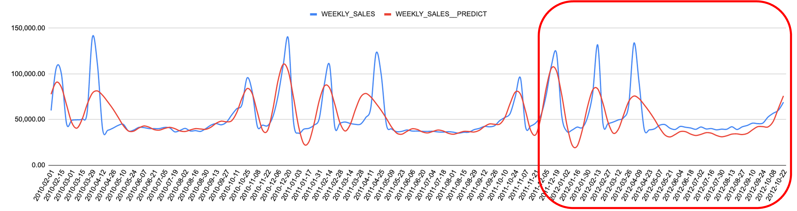
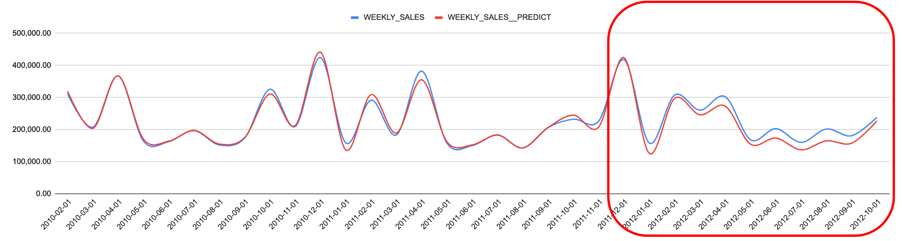

## Introduction
dbt-forecast is an experimental project aimed at providing a more user-friendly and accurate forecast experience for Snowflake. The forecast solution is implemented as a Stored Procedure within Snowflake's integrated Python environment (Snowpark).

The current version of the project supports forecasting for one category, allowing the user to forecast multiple products with a single run. In the future, this feature will be further enhanced to provide more granular analysis and improve overall accuracy.

Please note that the package is not currently compatible with the generate_schema_name feature in dbt, but this issue will be addressed in future releases.

For testing purposes, you can use the retail sales forecast dataset available on Kaggle (https://www.kaggle.com/code/aremoto/retail-sales-forecast/data?select=stores+data-set.csv). The dataset is already included in the seed.

## Prophet or ARIMA
When choosing between Prophet and ARIMA for time series forecasting, it's important to consider the complexity and required expertise of each model.

Prophet is easier to use and interpret, making it a more accessible option for those who are less familiar with time series forecasting. However, it is specifically designed for time series with strong trends and seasonality, so it may not perform well with other types of series.

On the other hand, ARIMA is a more complex model that requires a higher level of knowledge and expertise. Although it has greater flexibility, it can struggle with time series that have strong trends and seasonality.

One weakness of Prophet is its handling of outliers. To address this issue, the current version of the project uses +-1.5 interquartiles for the first and third quantiles to deal with outliers.

## Evaluation
### Weekly

### Shaped to Monthly view

## Usage

1. Clone the repository

2. Build the Docker container using the following command
    
    ``docker-compose build``
3. Start the Docker container using the following command
    
    ``docker-compose run --rm sf``
    
4. (Optional) To generate the Snowpark function, after logging into the container, use the following command
    ``python scripts/sf_func_gen.py``

5. Start testing the function by running the following command
    ``dbt build``

## Extra feature

### Support country holiday in prediction
In order to use this feature, please include ``COUNTRY`` as a field name from your input model. Check ``int_sds_train_country`` as example use case.

### Reuse the last best params for future runs (still testing)
To improve the performance, the function re-use the best params from previous run, instead running simulation to search for best params again (this process is very expensive).

## Extra note
Param grid used in Snowpark (~32 simulation for each category)

    params_grid = {'seasonality_mode': ['multiplicative','additive'],
                    'changepoint_prior_scale': s._CHANGEPOINT_PRIOR_SCALE,
                    'growth': ['linear', 'logistic'],
                    'changepoint_range': s._CHANGEPOINT_RANGE,
                    'daily_seasonality': [True, False],
                    'weekly_seasonality': [True, False],
                    'yearly_seasonality': [True, False]
                    }